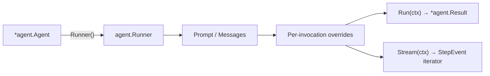

# Agent Runner

An Agent Runner configures and executes one invocation of a reusable
[`*agent.Agent`](/core/agents). Create it with `Agent.Runner()`, add the ordered
input and any request-local overrides, then choose blocking aggregation or
streaming:



`agent.Runner` is a value-style builder. Its methods return independent values
and never mutate the Agent or a sibling Runner.

## Run with overrides

Build the reusable Agent before creating the per-invocation Runner:

```go
assistant, err := agent.New(model).
	Instructions("Answer carefully and state uncertainty.").
	Tools(tools).
	Build()
if err != nil {
	return err
}

result, err := assistant.Runner().
	Prompt("Find the weather in Hanoi").
	Temperature(0.2).
	ActiveTools("weather").
	MaxTurns(4).
	ToolConcurrency(2).
	Run(ctx)
if err != nil {
	return err
}

fmt.Println(result.Text)
fmt.Println(result.Steps)
```

The ordering is significant conceptually: build the reusable Agent first,
then create a Runner for one input, then apply invocation-specific overrides.
Builder defaults may still be used when every run should share the same value.

`ToolConcurrency(1)` executes tools serially. Higher values allow tool bodies
to finish in parallel, while results and transcript messages are committed in
model-call order.

## Ordered messages and multimodal input

A new Runner starts without input. Supply at least one valid message:

- `Messages(messages...)` replaces the complete ordered input sequence.
- `Message(message)` appends one complete message.
- `Prompt(text)` appends one text user message.

Use `Messages` for chat history, multimodal content, prior tool calls and
results, or approval-response history:

```go
result, err := assistant.Runner().
	Messages(
		aikit.SystemMessage("Use the supplied trip context."),
		aikit.Message{
			Role: aikit.RoleUser,
			Content: []aikit.ContentPart{
				aikit.TextPart("Describe this destination"),
				aikit.ImageURLPart("https://example.com/destination.jpg"),
			},
		},
	).
	Message(aikit.UserMessage("Then suggest what to pack.")).
	Run(ctx)
```

Messages and nested mutable values are cloned before execution. Invalid roles,
empty input, an empty `Prompt`, a tool result without its preceding tool call,
or an approval response without its request fail synchronously with
`*agent.RunError`.

## Turn budget and early stopping

`MaxTurns` is the hard total number of model calls in this run. The initial
request, tool-result continuations, invalid-call retries, and any constrained
finishing call after a terminal tool turn consume the same budget. A normal
structured-output text turn is parsed in place and does not consume an extra
turn. `MaxTurns` defaults to the Agent value, which is `1` unless configured,
and must be positive.

`StopWhen` may finish earlier but cannot expand the budget. There is no zero or
negative sentinel for an unbounded run.

```go
result, err := assistant.Runner().
	Prompt("Research this and use tools when needed.").
	MaxTurns(2).
	Run(ctx)

var exhausted *agent.MaxTurnsError
if errors.As(err, &exhausted) {
	partial := result
	if exhausted.Result != nil {
		partial = exhausted.Result
	}
	return savePartial(partial)
}
if err != nil {
	return err
}
```

When another model call is required after the budget is spent, `Run` returns a
typed `*agent.MaxTurnsError` with the partial Result and canonical Transcript.
The last committed step retains its real finish reason.

## Result and transcript

`Result` is the single aggregate for the invocation. It contains:

- the independently owned full `Transcript`;
- individual `Steps` and the final step;
- final text, reasoning, finish reason, and provider metadata;
- aggregate usage, tool results, and pending approvals;
- warnings, sources, generated files, and structured output.

`GeneratedMessages()` derives only the continuation produced by the run; it
does not store a second message history.

## Stream one run

`Runner.Stream` returns a single-use, single-owner
`iter.Seq2[aikit.StepEvent, error]`:

```go
events, err := assistant.Runner().
	Prompt("Explain Go channels").
	Stream(ctx)
if err != nil {
	return err // validation failed before streaming began
}

for event, err := range events {
	if err != nil {
		return err
	}
	if event.Type == aikit.StepEventTextDelta {
		fmt.Print(event.TextDelta)
	}
}
```

Range the sequence once. A second range returns `agent.ErrStreamUsed`.
Breaking the loop cancels the child context and releases provider and tool work
owned by this run. Use `Run` when an aggregate is needed.

Committed events are yielded before a terminal runtime error. In particular,
turn-budget exhaustion yields the committed step and tool-result events, then
returns the same `*agent.MaxTurnsError`; it does not emit a successful done
event.

## Hooks and accepted turns

Hooks registered with `Builder.Hook` are copied into every Runner. A hook added
with `Runner.Hook` is appended only for that invocation, after Agent hooks.
They observe and steer the same driver used by `Run` and `Stream`.

A model call proceeds through request preparation, provider response,
model-turn acceptance, tool dispatch, tool-result presentation, and either a
continuation or finalization. The streaming path additionally exposes text and
tool-call deltas plus the provider stream finish. A model-turn hook may reject
a tool-free response and repeat it, optionally appending corrective feedback.
Every repeat is another model call and consumes `MaxTurns`.

When a model-turn hook is present, the runner holds one turn's deltas until
that turn is accepted. This applies to both `Run`'s result reduction and
`Stream`'s public iterator, so a rejected turn cannot leak into a Result or an
AI SDK v7 stream. It is intentional opt-in latency and bounded per-turn
buffering, not a new UI protocol rollback event. Tool-call turns cannot be
retried at that boundary; steer those with a tool-call hook.

See [Hooks](/core/hooks) for the complete event/action matrix, patch merge
rules, scratchpad, raw-versus-presentation results, and security boundary.

See [Streaming](/core/streaming) for the difference between direct model and
Agent event streams, [Structured output](/core/structured-output) for final
schema-constrained turns, and [Error handling](/guides/error-handling) for
partial results.
