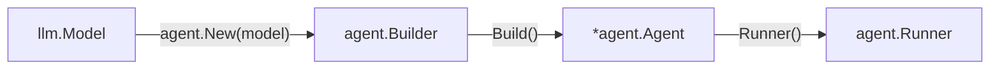

# Agents

An Agent is a reusable, immutable configuration built on top of an
[`llm.Model`](/core/completions). It combines the model with system
instructions, tools, model settings, hooks, approval policies, and other
long-lived defaults.

The lifecycle is intentionally split in two:



A configured Agent is reusable, while a per-prompt Runner owns one execution.
In ai-go, `Agent.Runner()` is the public run builder; the provider/tool state
machine remains an implementation detail.

## Build an Agent

Create tools first, place them in an immutable registry, and attach that
registry to the Agent Builder:

```go
weather, err := tool.New(
	"weather",
	"Get the current weather for a city",
	func(ctx context.Context, input struct {
		City string `json:"city" description:"City name"`
	}) (struct {
		Summary string `json:"summary"`
	}, error) {
		return struct {
			Summary string `json:"summary"`
		}{Summary: lookupWeather(input.City)}, nil
	},
)
if err != nil {
	return err
}

tools, err := tool.NewSet(weather)
if err != nil {
	return err
}

assistant, err := agent.New(model).
	ID("travel-assistant").
	Instructions("Answer carefully and state uncertainty.").
	Tools(tools).
	Temperature(0.2).
	Build()
if err != nil {
	return err
}
```

Builder methods use value semantics: every fluent call returns a new Builder.
`Build` validates the complete configuration and defensively copies mutable
values. The resulting `*agent.Agent` has no exported mutable state and may be
used to create concurrent runs.

Registered tool implementations still need to be concurrency-safe when an
application executes runs concurrently or enables parallel tools within one
run.

## Agent defaults

Keep stable behavior on the Agent:

- model and Agent identifier;
- system instructions;
- immutable tool registry and default active-tool policy;
- model settings and provider-specific options;
- structured-output schema;
- approval policies, hooks, logging, and tracing;
- default turn and tool-concurrency limits.

Put request-specific input and overrides on the Runner instead. For example,
user messages, a tighter turn limit for one request, or a request-local
temperature belong to that Runner invocation.

`Build` rejects invalid defaults before provider I/O, including a nil model,
invalid limits, impossible tool choices, unknown active or approval-gated
tools, invalid output schemas, nil hooks, and incomplete approval
configuration.

## Agent accessors

An Agent exposes only stable metadata:

```go
fmt.Println(assistant.ID())
fmt.Println(assistant.Instructions())
fmt.Println(assistant.MaxTurns())
```

The tool registry and other mutable-looking values are deliberately not
exposed through the Agent. Configure them with the Builder or override them on
a fresh Runner.

## Next: run the Agent

After building the Agent, create a new Runner for every invocation:

```go
result, err := assistant.Runner().
	Prompt("Find the weather in Hanoi").
	MaxTurns(4).
	Run(ctx)
```

See [Agent Runner](/core/agent-runner) for ordered input, per-run overrides,
multi-turn budgets, results, and streaming. Next, see [Hooks](/core/hooks),
then [Tools](/core/tools) for construction and approval behavior.
