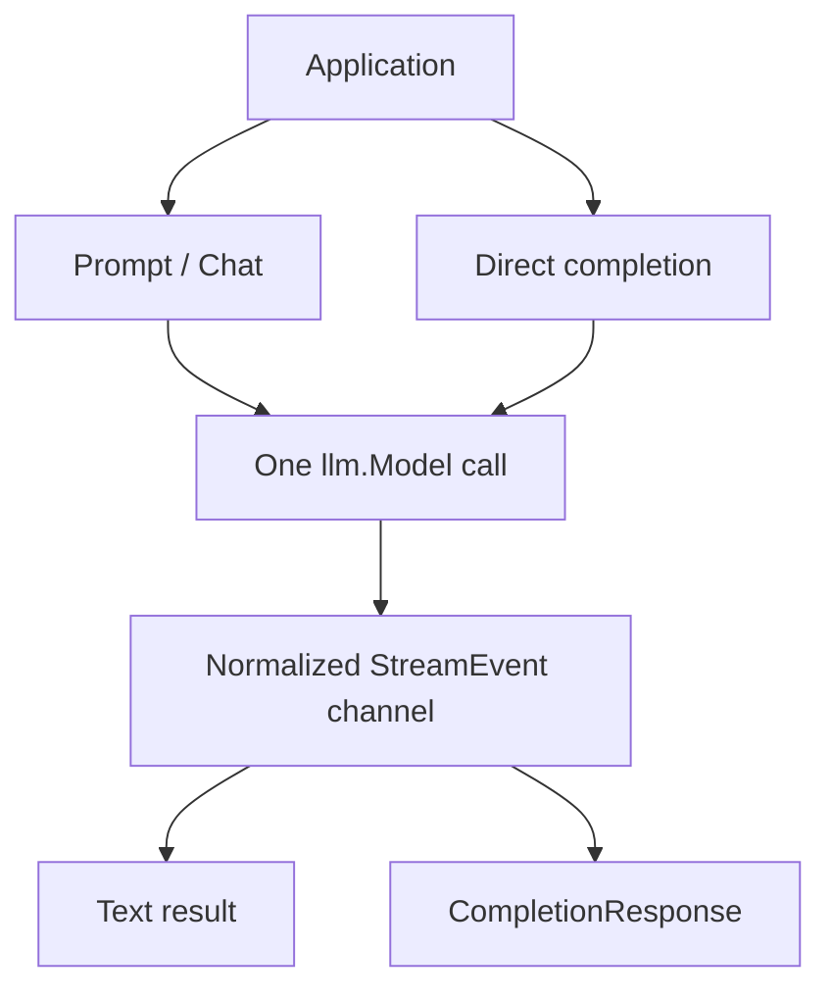

# Completions

Completion is ai-go's provider-neutral layer for asking a language model to
produce an assistant message. It exposes four API levels: convenient one-shot
text APIs, a direct response builder, and typed direct completion, using
ordinary interfaces, functions, value builders, and channels.

The completion APIs cover one provider model call:

| API | Result | Model calls | Tool execution |
| --- | --- | ---: | --- |
| `ai.Prompt` | Aggregated text | 1 | Never |
| `ai.Chat` | Aggregated text with supplied history | 1 | Never |
| `ai.NewCompletion` / `ai.Complete` | Complete normalized assistant response | 1 | Never |
| `ai.CompleteObject[T]` | Typed object and normalized response | 1 | Never |

Use the highest-level API that preserves the control your application needs.
Choose a completion when the application owns conversation state, tool
execution, and provider request settings. Use an [agent](/core/agents) when the
SDK should own a multi-step tool loop.



## Core contracts

The provider boundary in ai-go is deliberately small:

```go
type Model interface {
  ModelID() string
  Stream(context.Context, llm.Request) (<-chan aikit.StreamEvent, error)
}
```

This interface lives in `llm` and is re-exported by the `ai` facade as
`ai.LanguageModel`. A provider translates `llm.Request` into its native API and
normalizes the response into stream events. Aggregation and agent behavior stay
outside the provider.

The small interface has two useful consequences:

- A provider only needs to implement one stream-first operation.
- Direct completion, text generation, middleware, fallback models, and agents
  can all consume the same model value.

Most applications should import `github.com/open-ai-sdk/ai-go/ai`. Import
`llm` and `aikit` directly when implementing a provider or building lower-level
infrastructure.

## Prompt and chat

`ai.Prompt` is the smallest one-shot API. It creates one user message, makes
one model call, aggregates text deltas, and returns a string:

```go
answer, err := ai.Prompt(ctx, model, "What is the capital of Vietnam?")
if err != nil {
  return err
}
fmt.Println(answer)
```

`ai.Chat` places existing history before a new user prompt. It copies the
history passed by the caller and does not mutate it:

```go
answer, err := ai.Chat(
  ctx,
  model,
  "And what is its population?",
  ai.UserMessage("Tell me about Hanoi."),
	ai.AssistantMessage("Hanoi is the capital of Vietnam."),
)
if err != nil {
  return err
}
fmt.Println(answer)
```

Both functions intentionally return only text. They discard the richer view
needed for tool calls, reasoning, usage, sources, generated files, warnings,
and continuation. Use a direct completion for those cases.

## Direct completion

`ai.NewCompletion` binds a prompt to a model and returns a
`CompletionRequestBuilder`. Calling `Send` performs exactly one provider call
and aggregates all normalized events:

```go
response, err := ai.NewCompletion(model, "Explain Go interfaces").
  Instructions("Answer for an experienced programmer.").
  Temperature(0.2).
  MaxTokens(500).
  Send(ctx)
if err != nil {
  return err
}

fmt.Println(response.Text)
fmt.Println(response.Usage.TotalTokens)
```

Instructions are separate from conversation messages. Prefer `Instructions`
for the system-level behavior of a request; use `Messages` for history that
must remain ordered with user, assistant, tool, file, and reasoning content.

### Request lifecycle

A direct completion follows a predictable path:

1. The builder creates a normalized `ai.CompletionRequest`.
2. The model translates that request into its provider-specific wire format.
3. The provider emits normalized `ai.StreamEvent` values.
4. `Send` folds the events into `ai.CompletionResponse`.
5. Tool calls are returned to the caller and are never executed automatically.

`Build` stops after step 1. `Stream` exposes step 3. `Send` performs steps 1–4
and returns any tool calls described in step 5 to the application.

### Request builder

The completion builder is an immutable-style Go value builder. Each method
returns a new top-level value, so defaults can be branched safely:

```go
base := ai.NewCompletion(model, "Summarize the report").
  Instructions("Use concise bullet points.").
  MaxTokens(300)

brief := base.Temperature(0.1).Build()
creative := base.Temperature(0.8).Build()
```

The builder copies top-level slices and maps that it owns. Pointers and nested
map or slice values still follow normal Go ownership rules; deep-copy them
before concurrent mutation.

| Builder method | Effect |
| --- | --- |
| `Model` | Replaces the bound model |
| `Instructions` | Sets system-level instructions |
| `Messages` | Replaces the complete conversation history |
| `Prompt` | Appends one user text message |
| `Tools` | Replaces callable tool definitions |
| `ToolChoice` | Sets automatic, required, disabled, or specific tool selection |
| `Output` | Requests a runtime-defined output schema |
| `Settings` | Replaces all common call settings |
| `Temperature`, `MaxTokens`, `TopP`, `TopK`, `Seed` | Sets an individual sampling limit or control |
| `StopSequences` | Replaces stop sequences |
| `With` | Attaches typed provider-specific options |
| `ProviderOptionsJSON` | Attaches provider options from a dynamic JSON-like map |
| `ToolsContext` | Supplies values keyed by tool name |
| `RuntimeContext` | Supplies request-scoped runtime values |

Model support for optional settings varies. Providers should translate the
settings they support and surface normalized warnings or errors for unsupported
or invalid values.

Use `CompletionFromRequest` when a normalized request already exists:

```go
request := ai.NewCompletion(model, "Summarize the report").
  Instructions("Use three bullets.").
  StopSequences("\n\nSources:").
  Build()

response, err := ai.Complete(ctx, model, request)
// Equivalent:
response, err = ai.CompletionFromRequest(model, request).Send(ctx)
```

## Messages and multimodal content

An `ai.Message` has a role and an ordered slice of content parts. Keeping the
parts ordered is important for reasoning replay, interleaved text and tool
calls, and mixed text/file responses.

| Role | Typical content |
| --- | --- |
| `ai.RoleSystem` | System text retained in explicit history |
| `ai.RoleUser` | Text, images, documents, and tool approval responses |
| `ai.RoleAssistant` | Text, reasoning, and tool calls |
| `ai.RoleTool` | Results corresponding to assistant tool calls |

Helper constructors cover common content:

- `ai.TextPart`, `ai.UserMessage`, `ai.AssistantMessage`, `ai.SystemMessage`
- `ai.ImageURLPart`, `ai.ImageDataPart`, `ai.ImageFileIDPart`
- `ai.FilePart`, `ai.FileDataPart`, `ai.FileIDPart`
- `ai.ReasoningPart`, `ai.ToolCallPart`, `ai.ToolResultPart`

For example, a multimodal user message can combine instructions and an inline
image without introducing a provider-specific request type:

```go
message := ai.Message{
  Role: ai.RoleUser,
  Content: []ai.ContentPart{
    ai.TextPart("Describe the important details in this screenshot."),
    ai.ImageDataPart(imageBytes, "image/png"),
  },
}

response, err := ai.NewCompletion(model, "").
  Messages(message).
  Send(ctx)
```

Not every provider or model accepts every content kind. The normalized type
preserves portability at the SDK boundary; it does not imply universal model
capability.

## Streaming

Call `Stream` to consume the provider's normalized events directly:

```go
events, err := ai.NewCompletion(model, "Explain Go interfaces").Stream(ctx)
if err != nil {
  return err
}

for event := range events {
  switch event.Type {
  case ai.StreamEventTextDelta:
    fmt.Print(event.TextDelta)
  case ai.StreamEventUsage:
    if event.Usage != nil {
      fmt.Printf("\n%d tokens\n", event.Usage.TotalTokens)
    }
  case ai.StreamEventError:
    return event.Error
  }
}
```

The stream may contain text, reasoning, tool-call argument fragments, usage,
sources, generated file data, finish metadata, warnings, and errors. Drain the
channel to receive terminal metadata and allow the provider to release response
resources. Cancel `ctx` when the consumer stops early.

An error can occur in two places:

- `Stream` can return an error before a channel is created, such as invalid
  configuration or failure to start the request.
- The channel can emit `ai.StreamEventError` after partial output has arrived.

`Send` handles both paths and returns a partial response together with the
stream error when aggregation had already begun.

## Completion response

`ai.CompletionResponse` contains both convenience fields and the complete
normalized assistant message:

| Field | Meaning |
| --- | --- |
| `Message` | Ordered assistant content, suitable for later history |
| `Text` | All text deltas concatenated |
| `Reasoning` | All reasoning deltas concatenated |
| `Usage` | Normalized token counts plus raw provider usage |
| `FinishReason` | Portable finish reason |
| `RawFinishReason` | Provider-native finish reason |
| `ProviderMetadata` | Provider metadata from the finish event |
| `Warnings` | Request or response normalization warnings |
| `Sources` | Provider-native source references |
| `Files` | Generated file or image bytes and media types |

`Text` and `Reasoning` are convenience views. Use `Message.Content` whenever
the ordering or individual part metadata matters. In particular, preserve tool
call IDs, JSON arguments, and thought signatures when continuing a
conversation.

Usage fields are zero when a provider does not report them. `RawFinishReason`,
raw usage, and provider metadata are useful for diagnostics, but application
control flow should prefer normalized fields when possible.

## Tool calls and manual continuation

Passing tool definitions allows a direct completion to request a tool, but it
does not register an executor and never invokes application code:

```go
request := ai.NewCompletion(model, "What is the weather in Hanoi?").
  Tools(ai.ToolDefinition{
    Name:        "weather",
    Description: "Get current weather for a city",
    InputSchema: map[string]any{
      "type": "object",
      "properties": map[string]any{
        "city": map[string]any{"type": "string"},
      },
      "required": []string{"city"},
    },
  }).
  ToolChoice(ai.ToolChoiceAuto).
  Build()

response, err := ai.Complete(ctx, model, request)
```

When the finish reason is `ai.FinishReasonToolCalls`, the application can
inspect `response.Message.Content`, execute each requested tool, and append both
the assistant message and matching tool-result messages to the next request:

```go
history := append([]ai.Message(nil), request.Messages...)
history = append(history, response.Message)
history = append(history, ai.Message{
  Role: ai.RoleTool,
  Content: []ai.ContentPart{
    ai.ToolResultPart("call_123", "weather", `{"temperature":31}`),
  },
})

next, err := ai.CompletionFromRequest(model, ai.CompletionRequest{
  Instructions: request.Instructions,
  Messages:     history,
  Tools:        request.Tools,
}).Send(ctx)
```

The tool result ID must match the provider-issued tool call ID. In real code,
derive the ID and tool name from the returned tool-call part rather than using
a literal. Preserve the original assistant `Message` instead of reconstructing
it from `Text`, because the message may contain required reasoning signatures
or multiple interleaved tool calls.

Use an [`Agent`](/core/agents) when ai-go should execute tools, enforce stop
conditions, handle approvals, and continue across multiple model calls.

## Typed completion

`ai.CompleteObject[T]` is the direct, typed counterpart to `ai.Complete`. It
derives JSON Schema from the exported fields of `T`, performs exactly one model
call, and unmarshals the aggregated text into `T`:

```go
type Capital struct {
  City    string `json:"city"`
  Country string `json:"country"`
}

request := ai.NewCompletion(model, "What is Vietnam's capital?").
  Instructions("Return the requested object.").
  Build()

result, err := ai.CompleteObject[Capital](ctx, model, request)
if err != nil {
  return err
}
fmt.Println(result.Object.City)
fmt.Println(result.Response.Usage.TotalTokens)
```

The result contains both `Object` and `Response`. If JSON decoding fails,
`Response` is still available for inspecting text, usage, finish metadata, and
warnings.

The schema is a request to the provider, not local semantic validation. Model
and provider support varies, and successful JSON unmarshalling does not enforce
domain rules. Validate the resulting Go value when the application requires
stronger guarantees. See [structured output](/core/structured-output) for the
agent-layer alternative.

## Provider-specific options

Common behavior belongs in the normalized request. Controls unique to a
provider belong in typed options attached with `With`:

```go
response, err := ai.NewCompletion(model, "Solve this carefully").
  With(openai.ProviderOptions{
    ReasoningEffort: "medium",
  }).
  Send(ctx)
```

Typed options are stored under the option's provider name. A later option for
the same provider replaces the earlier one. `ProviderOptionsJSON` exists for
configuration decoded dynamically from JSON; typed Go code should prefer
`With` so invalid shapes are easier to catch.

Provider configuration such as credentials, base URL, HTTP client, and timeout
belongs on the provider client. Per-request provider behavior belongs on the
completion request. See [providers and clients](/core/providers-and-clients).

## Error handling

Always inspect both values returned by `Send` or `Complete`:

```go
response, err := ai.NewCompletion(model, prompt).Send(ctx)
if err != nil {
  if response != nil {
    log.Printf("partial text: %q", response.Text)
    log.Printf("usage before failure: %+v", response.Usage)
  }
  return err
}
```

Failures before streaming starts return a nil response. Failures emitted after
one or more events return the partially aggregated response and the error.
Provider errors remain provider-defined Go errors, so use `errors.Is` or
`errors.As` when a provider exposes typed error details.

## Choosing an API

- Use `ai.Prompt` for one string in and one string out.
- Use `ai.Chat` when you already have history and only need the next text.
- Use `ai.NewCompletion` when you need rich content, streaming, usage, tools,
  provider options, or manual continuation.
- Use `ai.CompleteObject[T]` for one typed, schema-constrained direct call.

For tool execution and multi-step generation, continue to
[Agents](/core/agents).

The direct completion layer is the best place to build custom orchestration:
it exposes the normalized request and full assistant response while keeping
provider transport details behind the minimal `llm.Model` interface.
