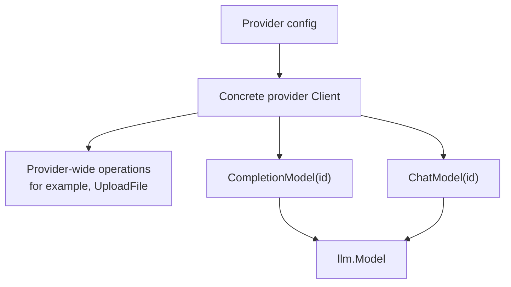
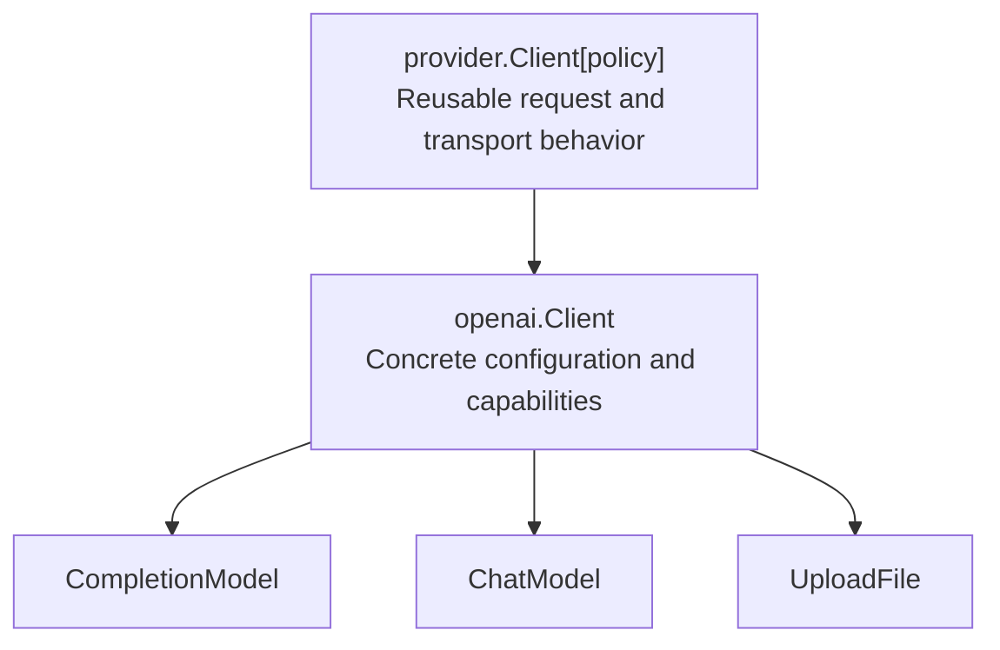

# Providers and clients

ai-go separates provider-wide resources from operation-specific model handles.
A concrete provider `Client` owns credentials, endpoint configuration, and
reusable HTTP resources. A model handle adds a model ID and one operation, such
as a Responses completion or a Chat Completions request.



Create one client and reuse it for related models:

```go
client, err := openai.NewClient(openai.Config{
  APIKey: os.Getenv("OPENAI_API_KEY"),
})
if err != nil {
  return err
}

responsesModel := client.CompletionModel("gpt-5")
chatModel := client.ChatModel("gpt-4o")
```

`NewClient` validates required configuration and transport setup immediately.
For OpenAI, a blank API key, malformed base URL, or negative timeout therefore
returns an error before the first model request. The SDK accepts configuration
explicitly and does not load environment variables or `.env` files; applications
remain responsible for obtaining secrets and passing them in.

Provider model handles are cheap values over the reusable client. Construct
the client and model handles once, then reuse them across requests.

## Model handles and capabilities

A factory method represents an operation supported by that concrete provider
client. OpenAI currently exposes:

- `CompletionModel`, which uses the Responses API;
- `ChatModel`, which uses Chat Completions; and
- `UploadFile`, a provider-wide operation that is not tied to a model ID.

This is Go's method-set capability system: a client that does not implement an
operation should not expose its factory method. There is no universal client
whose unsupported methods fail only at runtime.

Capabilities belong to operations, not permanently to a model name. The same
model ID may be used to create more than one kind of handle when the provider
and model support those operations. Conversely, the presence of a client
factory does not promise that every model ID accepted by the provider supports
it; the upstream API remains authoritative and can reject an incompatible
model-operation pair.

OpenAI does not currently expose an `ImageModel` factory in ai-go. A dedicated
image-generation implementation would add that method to the concrete client;
it should not be inferred merely because a completion can contain an image.

The base `llm.Model` remains stream-first. Providers with a native
single-response endpoint may also implement `llm.CompletionModel`. Native
completion keeps the provider's successful DTO in
`CompletionResponse.RawResponse` while still filling all normalized fields.
Provider authors should wrap failures with `llm.WrapCompletionError` and retain
the underlying transport, JSON, or `aikit.APIError` cause.

## Mixed completion output

`CompletionModel` describes the request operation, not a text-only result. A
provider stream can interleave text, reasoning, tool calls, and generated
files. When a file event is emitted, a direct completion retains it in both:

- `CompletionResponse.Files`, for convenient file access; and
- `CompletionResponse.Message.Content`, in event order with the other assistant
  content so the message can be used for continuation.

Whether a particular provider and model can produce mixed text and image/file
output is still a runtime provider capability. It is distinct from a dedicated
`ImageModel`, which would provide an image-generation-specific request API.

## Provider-wide operations

Operations that do not depend on a model ID live on the client. For example:

```go
file, err := client.UploadFile(ctx, openai.UploadFileRequest{
  Filename:  "report.pdf",
  Purpose:   openai.FilePurposeUserData,
  Data:      report,
  MediaType: "application/pdf",
})
if err != nil {
  return err
}

fmt.Println(file.ID)
```

This keeps credentials and transport ownership in one place and avoids using a
model as an accidental gateway to unrelated provider APIs.

## Reusable provider infrastructure

The exported `provider.Client[P]` is infrastructure for implementing concrete
providers, not the usual application entry point. Its type parameter implements
`provider.Policy`, which supplies the provider name, default base URL, and
request authorization policy. The generic client centralizes authenticated
request construction and regular or streaming HTTP execution.

Concrete packages compose that infrastructure and expose an idiomatic public
API:



Applications should normally use `openai.Client` or another concrete provider
client. Keeping the generic layer behind a concrete type prevents provider
policy details and generic parameters from leaking into ordinary application
code.

## Compatibility constructors

`openai.NewLanguageModel` and `openai.NewChatLanguageModel` remain available for
source compatibility. They preserve their historical constructor shape,
including deferred configuration errors. New code should prefer `NewClient`
because it validates eagerly and lets multiple lightweight model handles share
the same provider resources.

See the [OpenAI provider guide](/providers/openai) for concrete configuration
and request examples.
