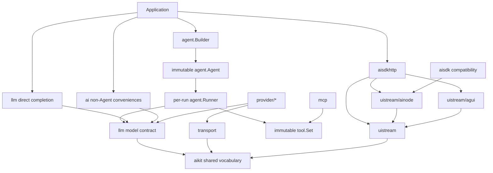

# Architecture

ai-go is organized as layers with a downward dependency direction. Provider
code and UI protocols meet through shared model and event contracts rather than
depending directly on one another.

## Public layers

### Application facade

The `ai` package contains non-Agent convenience operations. Agent contracts
are not aliased or forwarded there; applications import their canonical owners
directly.

### Completion and agent execution

`llm` owns direct model contracts and completion request builders. `agent` owns
one public multi-turn lifecycle: a value Builder creates an immutable Agent,
and each value Runner owns one invocation's ordered messages and overrides.
`Run` and `Stream` share one driver and Result reducer.

This ordering is reflected in the concept guides: first configure an
[Agent](/core/agents), then create a Runner and execute through the
[Agent Runner](/core/agent-runner) lifecycle.

### Shared vocabulary

`aikit` contains dependency-light messages, content parts, stream events,
usage, warnings, and errors. Providers and consumers exchange these values
without importing one another.

### Providers and transport

Concrete packages under `provider/*` encode provider APIs and typed options.
Provider clients share credentials and HTTP resources; model handles add a
model ID and operation. `transport` centralizes safe request construction, SSE
handling, cancellation, and provider HTTP errors.

### Integrations

`mcp` adapts Model Context Protocol tools into the immutable registry.
`aisdkhttp` consumes the Runner's single-owner `aikit.StepEvent` iterator
through `uistream.Pipe`. Protocol adapters translate leaf events without
importing `agent`; `aisdk` preserves the original AI SDK v7 public surface as
aliases and forwarders to `uistream/ainode`.

See the [package map](/reference/package-map) for package-by-package ownership.
