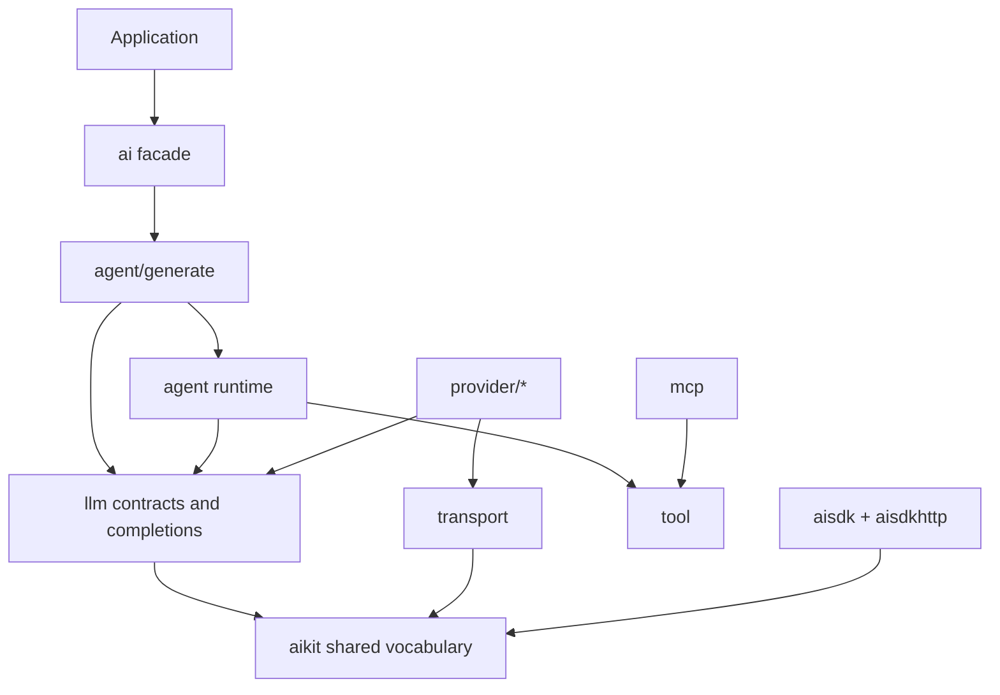

# Architecture

ai-go is organized as layers with a downward dependency direction. Provider
code and UI protocols meet through shared model and event contracts rather than
depending directly on one another.

## Public layers

### Application facade

The `ai` package exposes the common generation workflow and aliases the shared
message, tool, and result vocabulary. Applications can use lower packages
directly when they need more control.

### Completion and agent execution

`llm` owns direct model contracts and request builders. `agent` owns the
multi-step tool loop, while `agent/generate` aggregates results and provides the
high-level generation API.

### Shared vocabulary

`aikit` contains dependency-light messages, content parts, stream events,
usage, warnings, and errors. Providers and consumers exchange these values
without importing one another.

### Providers and transport

Concrete packages under `provider/*` encode provider APIs and typed options.
Provider clients share credentials and HTTP resources; model handles add a
model ID and operation. `transport` centralizes safe request construction, SSE
handling, cancellation, and provider HTTP errors.

### Integrations

`mcp` adapts Model Context Protocol tools. `aisdk` and `aisdkhttp` translate
normalized events into AI SDK v7-compatible UI streams at the HTTP boundary.

See the [package map](/reference/package-map) for package-by-package ownership.
