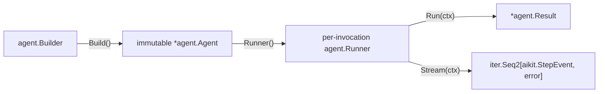

# Package map

The dependency graph points downward. `aikit` is the leaf vocabulary;
providers do not import the UI protocol, and `aisdk` does not import Agents or
providers.

| Package | Responsibility |
| --- | --- |
| `ai` | Non-Agent convenience operations such as objects, embeddings, images, and cost helpers |
| `agent` | Agent Builder, immutable Agent, per-run Runner, results, hooks, approvals, and multi-turn execution |
| `aikit` | Dependency-free messages, content, step/stream events, usage, warnings, and errors |
| `llm` | Model contracts, direct completion builder, normalized requests, provider options, embeddings, and images |
| `tool` | Typed/dynamic tools, canonical rich results, safe errors, immutable registry, and execution context |
| `transport` | Provider HTTP policy, retries, SSE reading, cancellation, and API error mapping |
| `provider/*` | Provider-specific constructors and wire codecs |
| `aisdk` | Frozen AI SDK v7 chunks, SSE framing, leaf-event conversion, and approval signatures |
| `aisdkhttp` | HTTP request/SSE boundary that consumes a single-owner `aikit.StepEvent` iterator |
| `mcp` | MCP clients and dynamic tool integration |

Agent code follows one ownership path:

Package `ai` does not alias or forward Agent symbols. The removed legacy Agent
package has no compatibility replacement: build an `agent.Agent`, call
`Agent.Runner()` for multi-turn execution, and use `llm.NewCompletion` for one
direct model call.
Applications that need to mock an Agent should define the narrow local
interface their code consumes.

The conceptual documentation follows the same dependency order: direct
[Completions](/core/completions), then [Agents](/core/agents),
[Agent Runner](/core/agent-runner), [Hooks](/core/hooks), and
[Tools](/core/tools).

The [README](https://github.com/open-ai-sdk/ai-go#readme) and Go package
documentation remain the canonical API references. This site focuses on the
workflows and architectural boundaries that make those APIs easier to compose.
